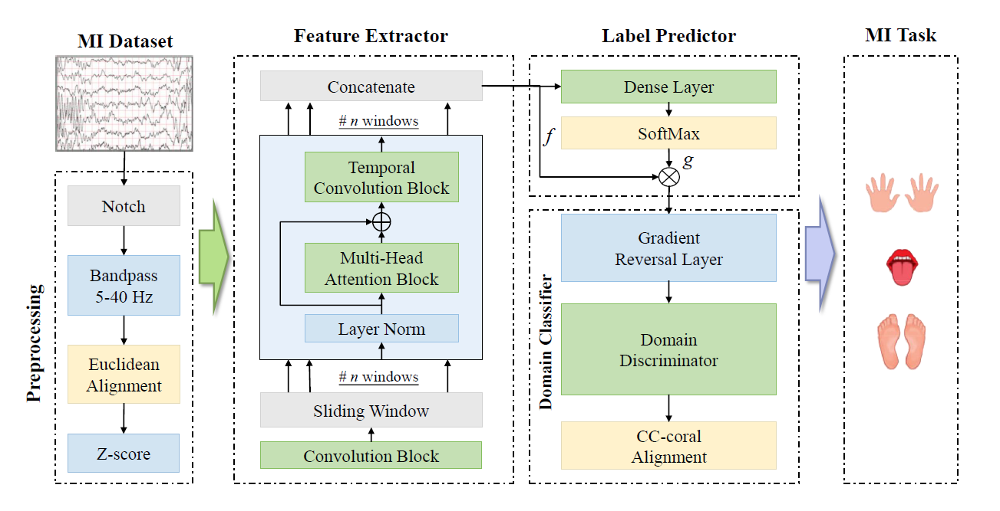
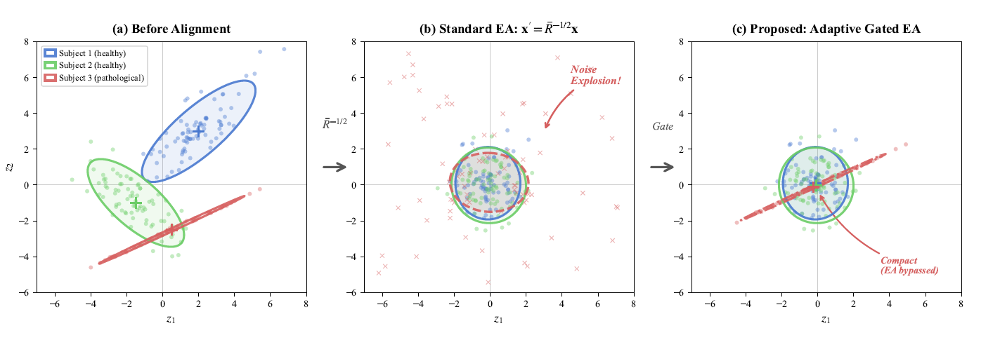
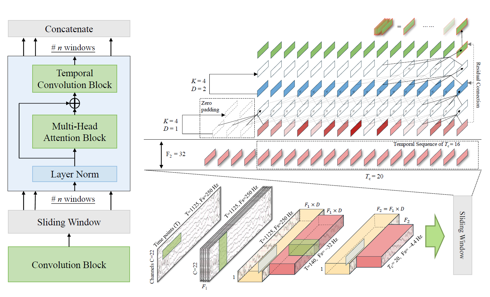
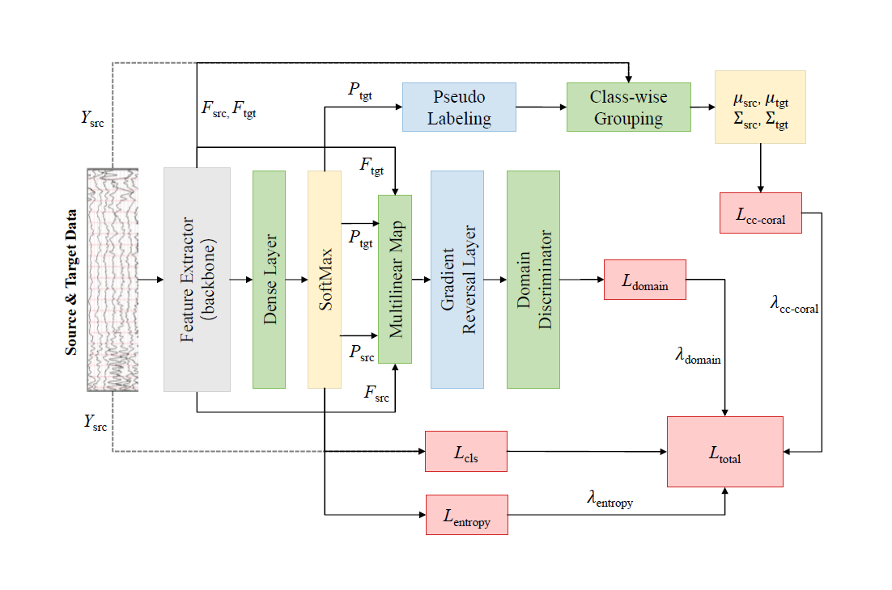
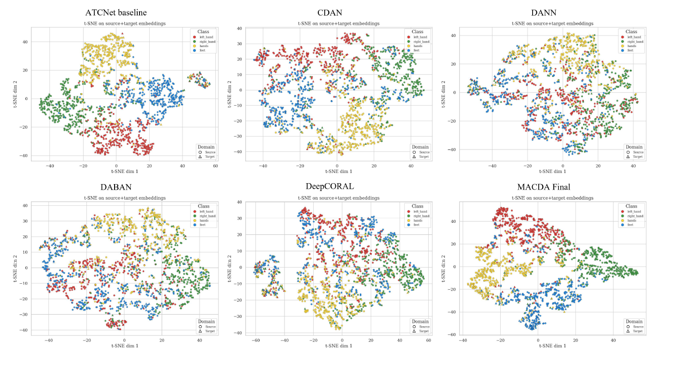

# MACDA：Manifold and Anchored Conditional Domain Adaptation for EEG-based MI-BCI
produced by Zhengyang Ding, UESTC

ATCNet-based EEG motor imagery experiments for cross-subject/domain transfer,
covering baseline training and several domain adaptation methods.

Current codebase supports both BCI Competition IV 2a (`bcic2a`) and
Weibo2014 (`weibo2014`), with LOSO workflows as the main evaluation mode for
adaptation methods.

## Implemented Methods

- ATCNet baseline
- ATCNet + DANN (`--dann`)
- ATCNet + CDAN (`--cdan`)
- ATCNet + CDAN + CCCORAL (`--cccoral`, requires baseline `--cdan`)
- ATCNet + SCDAN (`--scdan`)
- ATCNet + Deep CORAL (`--coral`)
- ATCNet + MI-DABAN (`train_pipeline_daban.py --daban`)
- Optional EA preprocessing (`--EA` / `--no_EA`)

## Method Principles and Figures (5)

This section follows the descriptions in `tex/MACDA_0330.pdf`.

### Figure 1: MAC-DA Overall Pipeline

Brief principle:

- MAC-DA performs progressive multi-space alignment: physical manifold normalization, deep feature extraction, global semantic adversarial alignment, and local semantic anchoring.
- The objective combines classification loss, entropy-aware domain adversarial loss, target entropy minimization, and ccCORAL loss.



### Figure 2: Entropy-Aware Euclidean Alignment (EAEA)

Brief principle:

- Standard EA may amplify noise for atypical/collapsed covariance subjects.
- EAEA introduces hard gating using covariance log-determinant statistics (`mu-sigma` rule): disable EA when target covariance quality is too low, reducing negative transfer.



### Figure 3: Hybrid Convolution-Attention Backbone (ATCNet)

Brief principle:

- The backbone uses convolution block + sliding-window multi-head attention + multi-scale TCN.
- It captures spectral-spatial patterns and temporal dependencies, producing sample-level representation for adaptation/classification.



### Figure 4: Joint Optimization Framework

Brief principle:

- Source/target features and classifier predictions are fused by multilinear mapping for conditional domain discrimination.
- ccCORAL performs class-conditional mean/covariance anchoring with pseudo-label confidence filtering and warmup, stabilizing adversarial training.



### Figure 5: t-SNE Visualization of Source-Target Features

Brief observation:

- Compared with ATCNet, DANN, CDAN, DABAN, and DeepCORAL, MAC-DA shows clearer class clusters and better source-target overlap.
- This is consistent with the paper's claim that global alignment and local anchoring work complementarily.



### Detailed Results (BCI IV 2a, LOSO, 5 seeds)

The table below follows the same granularity as Table 3 in `MACDA_0330.pdf`
(Best Seed, Mean ± Std, and Kappa):

| Group | Method | Best Seed (%) | Mean ± Std (%) | Kappa (Mean ± Std) |
| --- | --- | ---: | ---: | ---: |
| Non-transfer baselines | EEGNet | 52.55 | 52.09 ± 12.11 | 36.12 ± 16.14 |
| Non-transfer baselines | EEGTCNet | 57.02 | 55.62 ± 13.02 | 40.82 ± 17.35 |
| Non-transfer baselines | TSSEFFNet | 58.56 | 58.19 ± 11.24 | 44.26 ± 14.98 |
| Non-transfer baselines | MSCFormer | 58.06 | 54.68 ± 17.15 | 39.58 ± 22.86 |
| Non-transfer baselines | ATCNet | 62.11 | 60.29 ± 13.86 | 47.06 ± 18.48 |
| Domain adaptation methods | DANN | 68.67 | 65.94 ± 14.32 | 54.59 ± 19.09 |
| Domain adaptation methods | DeepCORAL | 68.48 | 66.09 ± 14.05 | 54.78 ± 18.73 |
| Domain adaptation methods | CDAN | 68.36 | 66.16 ± 14.48 | 54.88 ± 19.31 |
| Domain adaptation methods | MI-DABAN | 67.21 | 65.07 ± 15.34 | 53.43 ± 20.46 |
| Proposed | **MAC-DA** | **72.18** | **69.77 ± 15.44** | **59.69 ± 20.58** |

Macro takeaway:

- On BCI IV 2a, MAC-DA outperforms the strongest DA baselines in both accuracy and kappa.
- On Weibo2014, MAC-DA mean accuracy is 53.70%, with +2.94 pp vs CDAN and +4.70 pp vs DANN.

## Main Entry Scripts

- `train_pipeline.py`
	- Main pipeline for baseline, CDAN-family, DANN, and Deep CORAL.
- `train_pipeline_ea.py`
	- Wrapper over `train_pipeline.py` with EA-oriented convenience switches:
		`--joint_gate`, `--progress_bar`, `--gate`.
- `train_pipeline_daban.py`
	- MI-DABAN training pipeline and CLI.

## Available Config Files

Current `configs/` directory includes:

- `configs/atcnet.yaml`
- `configs/atcnet_dann.yaml`
- `configs/atcnet_cccoral.yaml`
- `configs/atcnet_scdan.yaml`
- `configs/atcnet_daban.yaml`

Notes:

- `train_pipeline.py` can parse `--cdanv2` and `--cdanv2_simple`, but matching
	config files are not present in current `configs/`.
- `--model` currently maps to `ATCNet` in `utils/get_model_cls.py`.

## Quick Start (Windows Example)

Use your environment Python executable.

Baseline LOSO:

```powershell
python train_pipeline.py --loso --dataset bcic2a --gpu_id 0
```

CDAN + CCCORAL:

```powershell
python train_pipeline.py --loso --dataset bcic2a --cdan --cccoral --seed 0 --interaug --gpu_id 0
```

DANN:

```powershell
python train_pipeline.py --loso --dataset bcic2a --dann --seed 0 --gpu_id 0
```

SCDAN:

```powershell
python train_pipeline.py --loso --dataset bcic2a --scdan --seed 0 --gpu_id 0
```

Deep CORAL:

```powershell
python train_pipeline.py --loso --dataset bcic2a --coral --lambda_coral 1.0 --seed 0 --gpu_id 0
```

MI-DABAN:

```powershell
python train_pipeline_daban.py --loso --dataset bcic2a --daban --seed 0 --gpu_id 0
```

EA wrapper (with progress bar):

```powershell
python train_pipeline_ea.py --progress_bar --loso --dataset bcic2a --cdan --cccoral --EA --seed 0 --gpu_id 0
```

## Core CLI Flags

Common:

- `--dataset {bcic2a,weibo2014}`
- `--loso`
- `--subject_ids` (supports `9`, `1,2,3`, `[1,2,3]`, `all`)
- `--seed`
- `--gpu_id`
- `--interaug` / `--no_interaug`
- `--EA` / `--no_EA`

Method switches (`train_pipeline.py`):

- `--cdan`, `--cccoral`, `--scdan`, `--dann`, `--coral`
- `--lambda_domain`, `--lambda_entropy`, `--no_lambda_schedule`
- `--lambda_cccoral`, `--cccoral_alpha`, `--pseudo_threshold`,
	`--min_samples_per_class`, `--cccoral_warmup_epochs`
- `--lambda_coral`

MI-DABAN (`train_pipeline_daban.py`):

- `--daban`
- `--lambda_domain`, `--lambda_conditional`, `--lambda_moment`,
	`--lambda_entropy`, `--no_lambda_schedule`
- `--use_random_layer`, `--random_dim`
- `--progress_bar` / `--no_progress_bar`

EA wrapper extras (`train_pipeline_ea.py`):

- `--joint_gate` / `--no_joint_gate`
- `--progress_bar` / `--no_progress_bar`
- `--gate` / `--no_gate`

## Result Structure

Training code may generate folders such as `curves/`, `tsne/`, and
`checkpoints/` depending on config and pipeline.

Current repository results have been cleaned to a compact archival layout.
For each experiment folder under `results/`, only these items are retained:

- `config.yaml`
- `results.txt`
- `confmats/avg_confusion_matrix.png`

All `curve/curves` folders and all `checkpoints` folders are removed in the
current workspace snapshot.

## Workspace Overview

- `datamodules/`: dataset loaders and LOSO/CDAN variants
- `models/`: ATCNet and adaptation modules
- `utils/`: metrics, plotting, EA gate, schedulers, data utilities
- `results/`: experiment outputs grouped by dataset/method

## Reproducibility Notes

- Compare methods under matched seeds.
- Use multi-seed aggregates instead of single-run conclusions.
- For adaptation methods, LOSO settings are strongly recommended (and may be
	auto-forced by pipeline logic).
